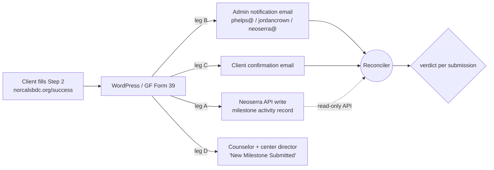

# API Troubleshooter (Milestone Delivery Watchdog) — Design

**Status:** v1 built (Aug 2026) — the `/api-troubleshooter` page, read-only Neoserra
probes, notification-email parser, diagnosis engine with copy-ready email drafts, and
homepage card. v1 is fully **stateless** (persists nothing — the strongest possible
non-interference guarantee); the automated Gmail ledger feed, reconciliation store, and
alerting (§4.1–4.4) are the next phase.
**Product name:** API Troubleshooter
**Direct link:** `https://tools.norcalsbdc.org/api-troubleshooter`
**Code:** `src/app/api-troubleshooter/`, `src/app/api/api-troubleshooter/`,
`src/lib/api-troubleshooter/` (types, parser, GET-only Neoserra reads, diagnosis engine),
tests in `tests/api-troubleshooter-parse.test.ts`.

---

## 0. Read-only guarantee — this tool observes, it never interferes

Hard constraints the implementation must satisfy; nothing below in this doc overrides them:

| System | What the troubleshooter does | What it can never do |
|---|---|---|
| WordPress / Gravity Forms | GET-only reads of the Entries ledger via the GF REST API, using an API key created with **READ permission only** | Cannot create/edit/delete entries, forms, notifications, or settings — the key itself lacks write rights |
| Gmail (phelps@) | Read + parse notification emails | Never sends, deletes, labels, or modifies mail |
| Neoserra API | `GET` requests only, with a read-only key if available | Never creates, updates, or deletes any record |
| The live /success flow | **Nothing.** Zero code in the submission path | Cannot slow down, block, or alter any client submission |
| Existing tools pages (`/milestone-log`, etc.) | Untouched — new standalone route | No shared state modified |

Concretely: the tool is a new, isolated page + API route in this repo. If the
troubleshooter itself breaks or is deleted, **nothing about the milestone form,
notifications, or Neoserra changes** — clients and advisors would never know it existed.
The only "write" it ever performs is saving its own analysis results to its own store.
**Companion doc:** `milestone-troubleshooting-plan.md` (July 2026) covers the *lookup* side
(Step 1 "email is not valid" failures — the Zimmers case). This doc covers the *delivery*
side: submissions that appear to succeed for the client but never land in Neoserra or never
reach the advisor. Together they cover the full pipeline.

**Trigger incident (Aug 5–6, 2026, Shasta-Cascade):** Quintin Gaddy reports client survey
responses not showing in Neoserra for clients 419762 (Woody's Brewing / Bart Hauptman) and
402390 (AhHomeChocolate / Francesca Hvitfeldtsen), and no advisor notification emails
received. Zack Barton witnessed the Woody's submission complete (confetti screen). Zack's
hypothesis: notification-email deliverability.

---

## 1. What the evidence already shows (Phase-0 findings, from Gmail alone)

Checked phelps@norcalsbdc.org on 8/6 — both "missing" submissions are **fully captured**:

| Client | Admin notification ("…Step 2") | Client confirmation ("Thank You…") |
|---|---|---|
| Woody's Brewing — contact 536464, business 419762 | ✅ Aug 5, 1:51 PM PT (single) | ✅ Aug 5, 1:51 PM PT to bart@woodysbrewing.com |
| AhHomeChocolate — contact 510322, business 402390 | ✅ Aug 4, 5:27 PM PT (**sent twice**, 2s apart) | ✅ (in earlier window) |

Conclusions that reshape the design:

1. **Gravity Forms captured both submissions.** The break is downstream of WordPress:
   either (a) the WP plugin → Neoserra API write failed/was rejected/hung, or (b) the
   record *was* written but is invisible to the advisor (e.g., sitting in Neoserra's
   milestone **approval queue**, or scoped to the wrong center), or (c) only the
   **counselor-facing** "New Milestone Submitted" email failed — which is the one leg
   where Zack's deliverability theory can still be right (Quintin's address is on an
   external domain, siskiyoucounty.org, more likely to spam-filter wpengine mail).
2. **The admin notification email is a complete, parseable ledger.** Its body contains
   Contact ID, Contact Email, Business (client) ID, every milestone field and value, and
   the signature — everything needed to verify delivery against Neoserra, with the Gmail
   message ID as a natural correlation ID.
3. **Two anomaly patterns are visible in the inbox right now** and belong in the taxonomy:
   - **Duplicate notifications:** ~half of Step 2 notifications in the last 14 days arrived
     twice within seconds (Anthony Lucero, Felicia Thomashill, Francesca, Connor Plant,
     ~15 more). Could be double form submission (double-click) or a double-firing
     notification feed — and may mean duplicate Neoserra writes.
   - **Suspect values:** Woody's payload computes *Change in Full-Time Employees: −9*
     (initial 15 → total 6; almost certainly the fields were entered swapped). Negative or
     inverted EI values are a plausible silent-rejection or silent-garbage class.

**Phase 0 next step (manual, needs Neoserra admin):** for the two clients, check
System Administration → API Audit Trail around the timestamps above (did a write arrive?
status Incoming/processed/error?) and the client activity + milestone approval queue.
Whichever branch it is (a/b/c above) becomes the first documented playbook entry.

**Update (Aug 6, GF Entries review):** the duplicates exist in Gravity Forms itself —
entries 522033 (Anthony Lucero) and 462767 (Felicia Thomashill) were each submitted
twice within the same minute. So class 11 is double *form submissions* (double-click /
double-tap on submit), not a double-firing notification feed — and each may produce a
duplicate Neoserra write. The GF Entries screen (Forms → Entries, form 39, 4,078
entries) is the definitive submission ledger; the troubleshooter now reads it directly
via the GF REST API (read-only key) instead of relying solely on parsed emails.
The live deployment also confirmed: the Neoserra key CAN look up contacts by email,
but CANNOT read milestone records back (all probe paths refused) — so delivered/missing
verdicts come from the GF-ledger + Audit Trail combination until milestone read access
is available.

---

**Neoserra read-endpoint map (verified live, Aug 6 2026):**

| Endpoint | Result |
|---|---|
| `GET /api/v1/contacts?email=` | ✅ works — bare rows (indivId, first, last, fkey) |
| `GET /api/v1/contacts/{id}` | ✅ works — full contact record, **no client links** |
| `GET /api/v1/relationships/{contactId}` | ✅ works — yields linked client IDs |
| `GET /api/v1/clients/{id}` | ✅ works — full client record (incl. ftEmps/ptEmps baseline) |
| `GET /api/v1/milestones?clientId=` / `?clients=` | ❌ hangs silently (classic Neoserra malformed-query behavior) |
| `GET /api/v1/clients/{id}/milestones` | ❌ 500 "Unrecognied link type" |
| `GET /api/v1/milestones/{id}` | ❌ 404 (object-get by milestone ID only, not by client) |

Net: contact→relationship→client chain is fully readable; **milestone records are
not queryable by client with this key**, so delivered-vs-missing verdicts require the
API Audit Trail (or a milestone read grant from Neoserra support).

## 2. Core idea: reconcile three independent evidence streams

Every submission leaves (or should leave) a trace in three places we can read **without any
WordPress/Gravity Forms access**:

- **Ledger of intent** — Gmail: every "New milestone submission … Step 2" email = one
  submission that reached WordPress. (Leg B has proven reliable; if leg B itself ever
  fails we detect it via volume drop, see §5.)
- **Ground truth of delivery** — Neoserra: does a milestone/EI record exist for that
  client ID in a window around the submission time, matching the milestone types claimed?
- **Client-facing truth** — the "Thank You" confirmation (leg C) tells us what the client
  was led to believe.

A submission is healthy only when B ∧ A (∧ C). Every mismatch is a classified incident.

## 3. Failure taxonomy v2 (extends classes 1–7 in the companion doc)

| # | Class | Signal pattern | Aug 2026 example |
|---|-------|----------------|------------------|
| 8 | **Submitted-but-not-written** | Admin email exists, no Neoserra record | Suspected: Woody's, AhHomeChocolate |
| 9 | **Written-but-invisible** | Neoserra record exists but pending approval / wrong center / wrong record type | Alternative explanation for #8 cases |
| 10 | **Advisor notification lost** | Record exists, counselor never notified | Zack's deliverability theory (external domains) |
| 11 | **Duplicate delivery** | Two notifications ±seconds; possibly two Neoserra records | ~50% of recent submissions |
| 12 | **Suspect values** | Negative deltas, swapped initial/current, zero-everything | Woody's −9 FTE |
| 13 | **Ledger silence** | Submission volume drops to zero vs. seasonal baseline — leg B itself broke | The failure mode that "goes unnoticed for a while" |

## 4. Components

### 4.1 Ledger ingester (Gmail → submission ledger)
- Poll Gmail (existing connected account) for `subject:"milestone submission"` +
  `from:no-reply@norcalsbdc.org` confirmations, on a schedule (hourly or daily).
- Parse the HTML table into a structured record: `{gmailMsgId, receivedAt, contactId,
  contactEmail, firstName, businessId, milestoneTypes[], fieldValues{}, signature}`.
- Dedup window: identical payload within 60s = one submission, `duplicateCount` noted
  (feeds class 11).

### 4.2 Neoserra verifier (read-only)
- For each ledger entry, query Neoserra for milestone/EI activity on `businessId` within
  a −1h/+48h window and compare milestone types.
- **Open question (blocking, see §7):** whether the current API key/endpoints can *read*
  milestone activities. `src/lib/neoserra.ts` today uses centers/events/attendees only.
  Fallbacks if the API can't: (a) a scheduled Neoserra export/report of recent milestone
  records ingested by the reconciler; (b) verify against the **API Audit Trail** manually
  for flagged items only — the watchdog still narrows "check everything" to "check these
  two."
- Verdicts: `DELIVERED`, `MISSING` (class 8), `PENDING_APPROVAL`/`SCOPED_ELSEWHERE`
  (class 9, if distinguishable), `DUPLICATE_WRITE` (class 11), `VALUE_ANOMALY` (class 12
  — flagged from ledger values alone, no Neoserra needed).

### 4.3 Reconciliation store
- One table/JSON store keyed by `gmailMsgId`, on the existing backend (the
  `/api/milestones/log` home is the natural place). Retention **≥ 13 months** — the
  problem recurs annually; year-over-year comparison must be possible.
- Backfill job: run the ingester over the full Gmail history of these notifications to
  quantify how much EI has historically gone missing (this also gives the seasonal
  baseline for class 13).

### 4.4 Alerting
- **Immediate** (within one polling cycle): any `MISSING` or `DUPLICATE_WRITE` →
  email to Aaron with the parsed payload, Neoserra client link, and the audit-trail
  timestamp to check.
- **Daily digest:** all verdicts, value anomalies, duplicate-submission count.
- **Heartbeat / class 13:** if zero submissions parsed in N days when the trailing
  4-week average is > 0 → alert. This is the guard against "the notifications quietly
  stopped," which is how these outages historically go unnoticed.
- **Advisor-leg spot check (class 10):** can't be observed from phelps@ directly.
  Mitigations: add a monitored mailbox (e.g., neoserra@norcalsbdc.org already receives
  leg B; add it as BCC on leg D in GF settings — the one config change worth making in
  WP), plus periodic SPF/DKIM/DMARC checks on norcalsbdc.org / wpengine sending domains.

### 4.5 Dashboard (extend `/milestone-log`)
- Add a **Delivery** column per submission: ✅ delivered / ⚠️ pending / ❌ missing /
  🔁 duplicate / 🚩 value anomaly.
- Failure-rate-over-time chart (answers "when did this start?" instantly).
- Per-client search → full trace: ledger entry, Neoserra verdict, links to the Neoserra
  client page and (manually) the API Audit Trail.

### 4.6 The page: `/api-troubleshooter`

The user-facing surface for everything above, at
**`https://tools.norcalsbdc.org/api-troubleshooter`** — deep-linkable so it can be pasted
into email threads with advisors. Auth: same password gate as `/milestone-log` (the page
shows client PII). A deep link with a query param
(`/api-troubleshooter?email=bart@woodysbrewing.com`) opens straight to that client's trace.

**Layout (top to bottom):**

1. **Search box** — client email, business ID, or contact ID.
2. **Health strip** — last 7 days: submissions received / delivered / flagged, and the
   heartbeat status ("Notifications flowing normally" vs. "⚠️ No submissions parsed in
   4 days — historical average is 3/day").
3. **Recent submissions table** — one row per ledger entry, newest first, with a
   plain-English status chip: ✅ Delivered to Neoserra · ⏳ Pending approval ·
   ❌ Not found in Neoserra · 🔁 Submitted twice · 🚩 Values look wrong.
4. **Detail view** (click a row or arrive via deep link) — the three-leg trace in plain
   English, one line per leg, each marked found/missing with timestamp. No jargon in the
   default view; raw payload behind a "show technical details" toggle.

**The centerpiece: plain-English diagnosis + copy-pasteable email.** Every flagged
submission renders a diagnosis card with a **"Copy email" button**. The generated text is
ready to paste to an advisor, center director, or Jordan Crown — no editing needed.
Example for the Woody's case:

> **Subject: Milestone submission for Woody's Brewing (client 419762) — status and next step**
>
> Hi —
>
> We looked into the milestone (EI) submission for Woody's Brewing and here's what we found:
>
> **What happened:** Bart Hauptman submitted the milestone form on Aug 5 at 1:51 PM.
> The form itself worked — the submission was captured and the confirmation email went
> out to bart@woodysbrewing.com. However, no matching record appears in Neoserra for
> client 419762.
>
> **Likely issue:** The handoff between the website form and Neoserra failed for this
> submission. One thing that stands out: the employee numbers appear to have been entered
> in reverse (15 initial staff → 6 current, which computes as *losing* 9 employees).
> Neoserra can silently reject records with values like this.
>
> **The fix:** No need to ask the client to resubmit — we have their complete answers.
> (1) Check Neoserra's API Audit Trail (System Administration → API Audit Trail) around
> Aug 5, 1:51 PM to confirm whether the record arrived; (2) if it's not there, the
> milestone can be entered manually from the data below; (3) confirm the intended figures
> with the advisor (likely 6 initial → 15 current, a gain of 9).
>
> **Their submission:** I Hired New Employees — Initial FT staff: 15, Current FT: 6,
> Initial PT: —, Current PT: 4 · Signed: Bart Hauptman · Contact 536464 · Business 419762
>
> This was generated by the API Troubleshooter:
> https://tools.norcalsbdc.org/api-troubleshooter?business=419762

Diagnosis templates exist per failure class (8–13), each with: what happened (facts with
timestamps), likely issue (plain English, hedged honestly when uncertain), the fix (who
does what), and the client's full submitted data so nobody has to ask the client to redo
anything. This turns the Quintin/Zack/Carrie email thread into a 30-second lookup and a
one-click reply.

## 5. Where it runs

Two viable hosts; recommendation is the first:

1. **Recommended — scheduled job on the existing Railway backend** (same place as the
   milestone log): it already holds `NEOSERRA_API_KEY`, already serves `/milestone-log`,
   and gives the dashboard a single store. Gmail access via a service account or Gmail API
   OAuth for phelps@ (or a dedicated forwarding address → simpler: auto-forward the Step 2
   notifications to a webhook/inbox the backend owns).
2. **Alternative — Claude Code Routine in this environment:** daily run that reads Gmail
   via the connected account, hits Neoserra, emails the digest. Faster to stand up, no
   backend deploy; weaker as a permanent home (no dashboard integration, session-bound
   credentials). Reasonable as the **interim watchdog** while the backend version is built.

## 6. Do we need WordPress / Gravity Forms access?

**No — not to build the catch-and-diagnose system.** The ledger (Gmail) + ground truth
(Neoserra) are sufficient to detect and classify every delivery failure, including the
current incident.

WP/GF access (or Jordan Crown's help) is needed only for **root-cause fixes** once the
watchdog points at the plugin:

- The GF → Neoserra plugin source: add request/response logging, retries, and an error
  path that *doesn't* show confetti when the API write failed (today the client sees
  success regardless — that's the trust-damaging part).
- GF notification settings: confirm leg D recipients per center; add a monitored BCC.
- GF entry logs: correlate entry IDs with the ledger (nice-to-have; the email ledger
  already carries the payload).

## 7. Open questions / blockers to confirm before building

1. **Can the Neoserra API read milestone/EI activity records** with the current key?
   (Determines §4.2 primary vs. fallback. Check the Neoserra API docs the network has;
   the in-repo client only exercises centers/events/attendees.)
2. Phase-0 manual check results for Woody's/AhHomeChocolate (API Audit Trail + approval
   queue) — decides whether the current incident is class 8, 9, or 10, and therefore
   which alert matters most.
3. Confirm who should receive immediate alerts vs. the daily digest.
4. Gmail access path for the production reconciler (OAuth for phelps@ vs. auto-forward
   to a backend-owned address — forwarding is simpler and keeps personal-mailbox
   credentials out of the backend).
5. Whether milestone records created via API enter an approval queue in Neoserra (if yes,
   "pending approval" must be a normal, non-alerting state with its own aging alarm —
   e.g., pending > 14 days).

## 8. Phasing

| Phase | Scope | Outcome |
|-------|-------|---------|
| 0 | Manual triage of Woody's/AhHomeChocolate via API Audit Trail + approval queue; answer §7 Q1 | Incident classified; playbook entry #1; API read capability known |
| 1 | Ledger ingester + backfill over full inbox history + daily digest (interim host OK) | Every submission since inception classified; historical loss quantified |
| 2 | Neoserra verifier + immediate MISSING/duplicate alerts + heartbeat | Delivery failures surface in hours, not via advisor complaints |
| 3 | Dashboard delivery column + self-serve diagnostic | Centers self-serve; engineering only sees real regressions |
| 4 | WP-side fixes (plugin logging, honest error screen, notification BCC) — needs WP/GF or Jordan Crown | Root causes eliminated, not just detected |
